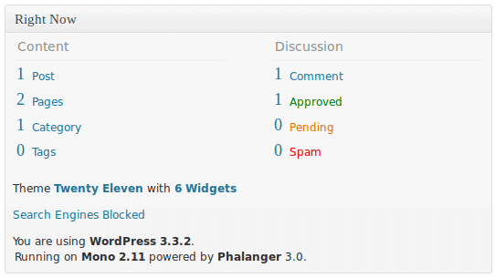

> **Note:** There is a new, modern PHP compiler to .NET entitled Peachpie, which is being developed at the moment. Please see [the Peachpie repository](https://github.com/iolevel/peachpie)

Phalanger was capable of compiling WordPress for quite a long time, but this support was always targeted at developer audience. Experienced developers could compile WordPress and run it on their servers. However, we noticed that the combination is interesting not only to developers, but also to end users. Some of WordPress users want to run it on .NET or on Mono. Mainly for performance reasons, but some of them also because they already have other stuff running on .NET. The problem was it is quite a tough job to install Phalanger, configure, compile… don’t mentioning that on shared hosting it can be a problem to install anything.

So today we’re happy to announce WP.NET (wpdotnet.com) – A package of WordPress with embedded Phalanger. One package gives watson s hong kong online store you WordPress for both .NET 4.0 and for Mono (2.10.8 and higher), with no installation hassles. If you have ASP.NET hosting it’s easy to deploy and when a new Phalanger is available, you can update it from administration section, just easily as WordPress update.

WP.NET is fully managed ASP.NET application. It does not contain any native code, so it’s possible to run it 64bit on Windows. The same package also works on Linux using Mono with version greater than 2.10.8.

Main advanteges are that WP.NET justin bieber photo sexe is faster than WordPress running on normal PHP and it’s also extendable with .NET languages. Which makes it great CMS that anyone can extend and it doesn’t matter what language he chose to use. The tutorial on how it’s possible to extend it with C# is going to be published withtin few days.

Some of the PHP plugins or more advanced functionality can require some more PHP extensions that are not included in package as it’s released today.

We are aware of it and there will be available package with most important managed extensions.

In the future we also plan to get WP.NET available via the Web Platform Installer.

You can find the package on its new home page wpdotnet.com and its sources on its GitHub repository https://github.com/DEVSENSE/WpDotNet. Feel free to check it or improve it ;-) .
