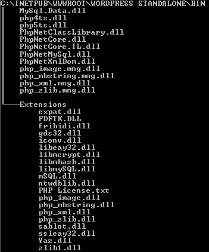

> **Note:** There is a new, modern PHP compiler to .NET entitled Peachpie, which is being developed at the moment. Please see [the Peachpie repository](https://github.com/iolevel/peachpie)

By Jakub Misek, 06/11/2011

A few people asked how to run their web site on top of Phalanger without a need of installing Phalanger. This seems to be useful idea, since you may not be allowed to (or you just don’t want to) install any additional software on a target machine. Since Phalanger works like standard ASP.NET request handler and uses a little of standard .NET configurations, it is possible. And the new version of Phalanger (June 2011) makes it even easier to configure.

The solution I found allows users to run their PHP/Phalanger code on an ASP.NET/IIS 7 hosting without a need of installing an additional software. It only requires a few prerequisites required by the Phalanger runtime that should be installed already. At first you need to have .NET 4 (full) installed. And secondly Visual C++ 2010 runtime.

# Making Phalanger app portable

In short we are going to take an output of the Phalanger installation and merge it with local configuration. Normally you have all the Phalanger assemblies installed in Global Assembly Cache, and the default configuration in your global machine.config file (see %windir%\Microsoft.NET\Framework\v4.0.30319\Config\ directory).

Following configuration can be applied e.g. on WordPress web we’ve built earlier. But it will work on any other Phalanger web or application. Just adjust the list of extensions you are using.

All the files can be obtained from the Phalanger source repository, or you can just extract the installation package.

# Assemblies

The web application requires several assemblies. They have to be just copied into the /Bin sub-folder of your web application, so they can be loaded by the ASP.NET application. By default copy following assemblies: PhpNetCore.IL.dll, PhpNetCore.dll, PhpNetClassLibrary.dll and PhpNetXmlDom.dll.

In addition to assemblies above, you will probably need some native PHP extensions (extensions not implemented as managed yet). In case of WordPress, you want to add mbstring, image, zlib and xml extensions at least. To add an extension, copy some files from the Phalanger distribution; copy managed wrapper of the extension from the /Wrappers folder, copy php4ts.dll and php5ts.dll and copy also folder Extensions. Note you can delete php_*.dll files representing extensions you are not going to use.



The tree above shows the content of my Bin folder placed within my WordPress web root directory. It contains all the necessary files to allow us using WordPress on .NET 4 without a need of installing Phalanger on target machine.

# Dynamic stubs

Phalanger needs to generate some assemblies to be used in some dynamic stuff cases. You must only provide him some directory with write access privileges. You can create a folder called “Dynamic” in the root of your application for example.

# Web.Config

To make the application portable, just add some basic configuration into your web.config file. This configuration is normally added automatically by the Phalanger installer into your machine.config, so it is applied on any other config file on the machine. Without installing Phalanger, you must set-up this basic configuration locally.

First add the <configSection> containing definition of <phpNet> configuration itself as follows:

```php
<configSections>
<section name=&amp;quot;phpNet&amp;quot; type=&amp;quot;PHP.Core.ConfigurationSectionHandler, PhpNetCore, Version=2.1.0.0, Culture=neutral, PublicKeyToken=0a8e8c4c76728c71&amp;quot; //>
</configSections>
```

Then define locations of your binaries. Define where your native PHP extensions are, where to generate dynamic stubs etc. You can place following configuration into your staff products generic <phpNet> configuration element:

```php
<paths>
<set name=&amp;quot;DynamicWrappers&amp;quot; value=&amp;quot;.\Dynamic&amp;quot;/>
<set name=&amp;quot;Libraries&amp;quot; value=&amp;quot;.\Bin&amp;quot;/>
<set name=&amp;quot;ExtWrappers&amp;quot; value=&amp;quot;.\Bin&amp;quot;/>
<set name=&amp;quot;ExtNatives&amp;quot; value=&amp;quot;.\Bin\Extensions&amp;quot;/>
</paths>
```

I should note, the relative paths above work only since June 2011 version of Phalanger. In earlier versions of Phalanger you have to provide absolute paths.

# Conclusion/Notes

This seems to be useful way how to use Phalanger since lot of people just don’t want to install additional software on their machines. You don’t have to install Phalanger, and still you will be able to run PHP or Phalanger web site on standard ASP.NET web server.

The code samples above extends the configuration provided in our WordPress on .NET 4 post, so it assumes you already have configured a few things.

The similar process can be applied when you want monthly drug canada to make Phalanger console or WinForm application portable. The assemblies just have to be copied into the application folder itself, not the Bin sub-folder.
