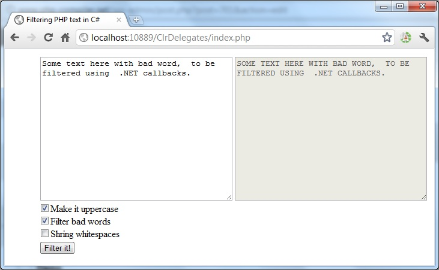

> **Note:** There is a new, modern PHP compiler to .NET entitled Peachpie, which is being developed at the moment. Please see [the Peachpie repository](https://github.com/iolevel/peachpie)

By Jakub Misek, 12/10/2011

Phalanger is the only solution allowing to seamlessly interoperate between PHP and .NET world. It allows to use e.g. .NET generics, namespaces, properties, method overloads, global variables, constants and .NET delegates in both worlds. In this post I will show how to pass delegates from C# into PHP, and how to use them in PHP.

This interoperability feature is available since Phalanger 3.0, and it is very useful e.g. when writing C# plugins for PHP systems.

Imagine you have PHP function foo, getting a callable argument. Now you can call such function from C#, and pass a delegate as you are used to:

```php
x.foo(new Action<int>((int i) =>
{ // do something
}));
x.bar(new Func<int, bool>(this.someMethod));
```

The conversion to PHP callable function accepts any advair viagra from canada .NET MulticastDelegate. In this way you can extend functionality of PHP application by passing .NET methods inside. PHP code itself does not need to be changed. It uses .NET delegates as usual PHP callable object; it can be called, copied or passed as callback to any function.

```php
function foo( $func ) {
    $func(123);
}
```

# Demo

To demonstrate the feature, we have a simple demo called ClrDelegates.



The application lets the .NET code to pass some delegates into PHP, and then it calls them to transform given text. It makes use of App_Code feature and other interoperability features that will be described in some future article.

```php
foreach ($callbacks as $fnc)
     $str = $fnc($str);
```

The usage from within PHP code is very natural, as you can see above.

# How does it work

When a MulticastDelegate object is passed from .NET to PHP world, Phalanger wraps the delegate into PHP object with __invoke() method. The __invoke() method is a natural way of creating callable PHP objects. Inside the function, it simply invokes original MulticastDelegate with given arguments. Thanks to this mechanism, PHP code does not even notice, it uses .NET delegates. You can only notice it by checking the class’s name.

Phalanger also checks if you are passing right amount of arguments. Note the types are not implicitly converted yet. .NET may throw an exception if argument’s type does not match the delegate’s type.

# Conclusion

Phalanger 3.0 offers easy and useful way of injecting .NET method callbacks into PHP. It is natural to use from within C# and PHP too. Download and try the ClrDelegates to see how seamlessly it works.


