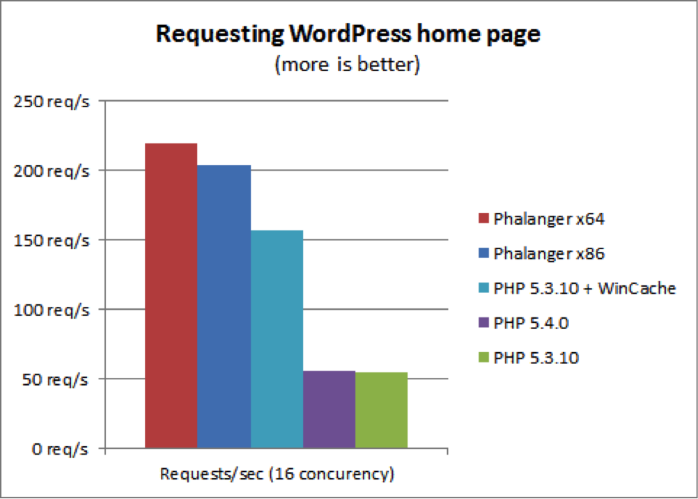
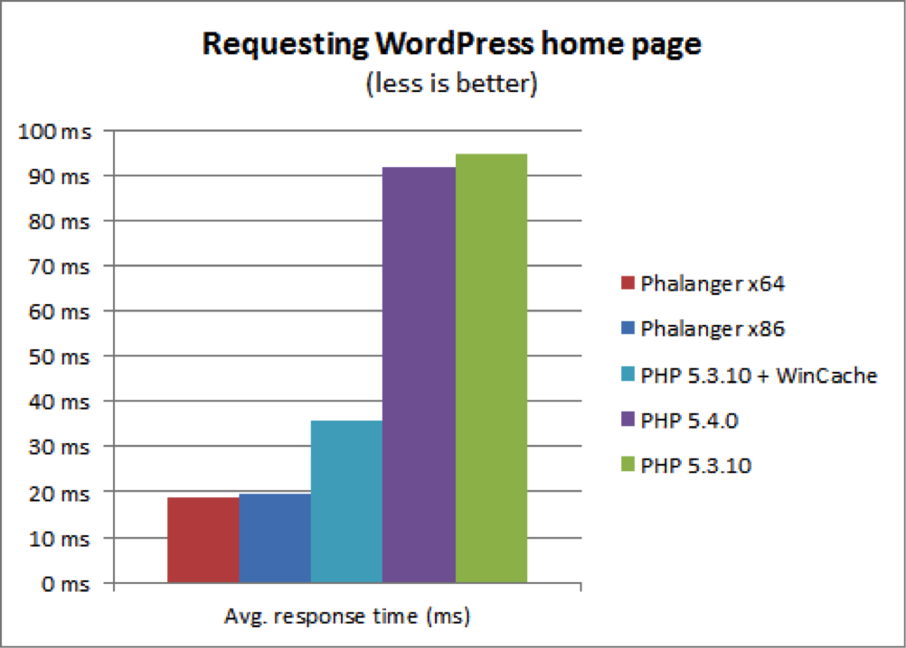
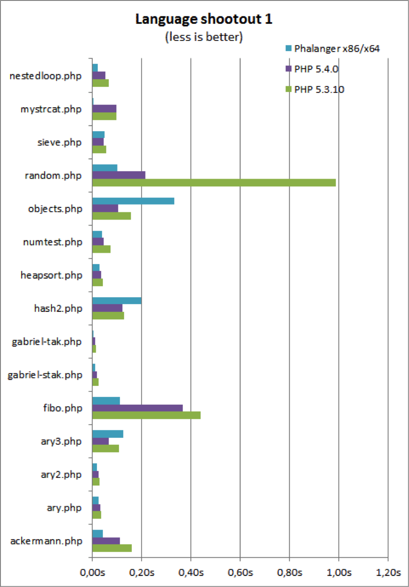
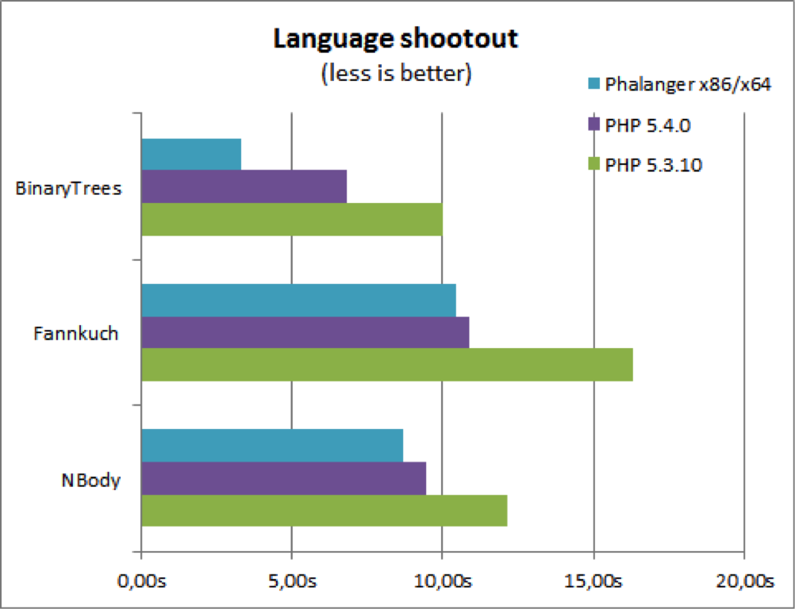
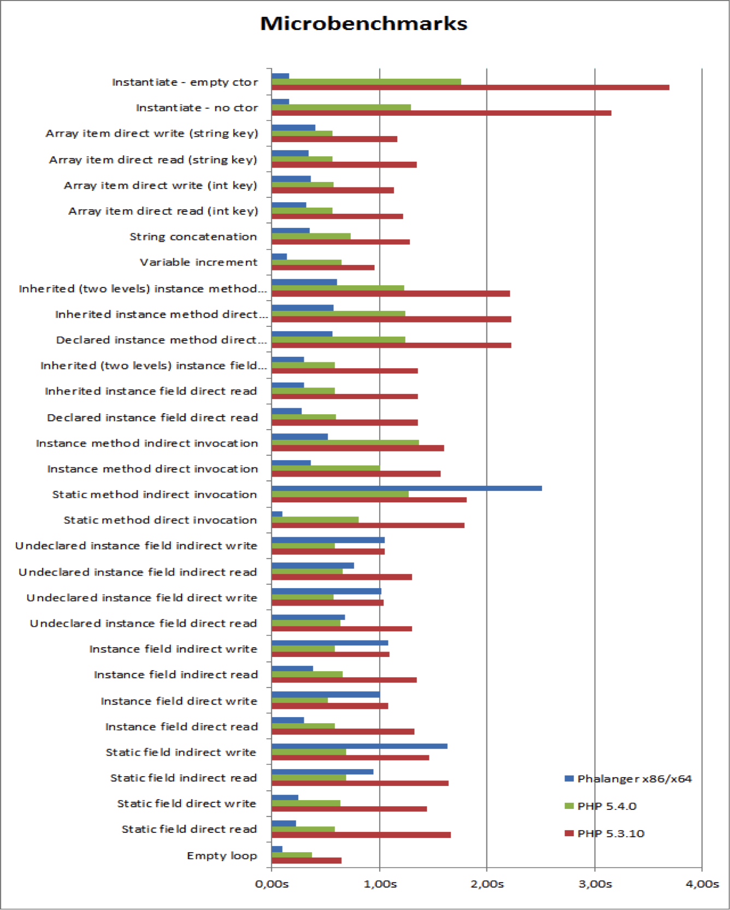

> **Note:** There is a new, modern PHP compiler to .NET entitled Peachpie, which is being developed at the moment. Please see [the Peachpie repository](https://github.com/iolevel/peachpie) and check out the latest [benchmarks on the project's website](http://peachpie.io/benchmarks).

# Benchmarks
The following benchmarks were performed using Phalanger (March 2012).

## WordPress benchmarks
-CPU: Core i7 2600K, 3.70 GHz, 16GB RAM
-Windows 7 Professional, 64 bit, IIS 7.5, .NET 4.0
-WordPress: 3.3.1, clean installation
-No output caching.
-Managed MySQL extension for Phalanger.

Tollowing tests are available in Phalanger’s source code repository. Benchmarks are performed on Core i7 2600K, 3.70 GHz, running as x86 or x64.

