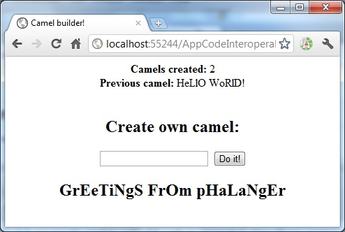

> **Note:** There is a new, modern PHP compiler to .NET entitled Peachpie, which is being developed at the moment. Please see [the Peachpie repository](https://github.com/iolevel/peachpie)

Phalanger 3.0 brings several cool and useful features, making interoperability between C# and PHP even easier. In this post, I will show one of them.

# Use cases

Imagine several use cases.

- You have a PHP web site consisting of many .php scripts, and you want to extend its functionality or completely rewrite its back-end into C#. As you are used to, you would like to write your C# code into special App_Code folder.
- You have ASP.NET web site already. And you are going to add some PHP scripts, because it is easier for your programmers or you have already the presentation layer in PHP. You still have to use existing C# objects from price of viagra in bangladesh within these PHP scripts.
- You have PHP web site, and you are going to slowly migrate to C#. You have to subsequently rewrite crucial parts of PHP code into C#, while other parts of your web are still in PHP. This hybrid web has to be working during the process normally.
All these cases have a common architecture. There are .php scripts all over the web site, and .cs scripts in App_Code folder. And you would like to use all your C# methods and classes seamlessly in the PHP code and vice versa.

# Setup

Before Phalanger 3.0 release, you would need to write C# code in separated class library project, compile it into an assembly and add the reference into web.config file. This process is being used, however makes development a little slower than it has to be.
Now this process is handled by ASP.NET and Phalanger altogether. You don’t have to configure anything and things do work as expected.
Any public class, written in a script in a .NET language and placed in the App_Code folder is seamlessly visible in your PHP code, using standard PHP syntax.
Demo

I’ve created simple demo here: App_Code interoperability. The demo consists of one PHP page, containing the presentation layer, using Class1 written in C#. Notice there is no configuration linking these two worlds, the things work as it would be expected in any other ASP.NET site.



The demo takes advantage of several features of Phalanger & ASP.NET.

- The web application remembers the last requested text and amount of requests. It is very easy thanks to the (real) static variables living in instance of ASP.NET AppPool. This technique can be used to achieve very effective in-memory caching.
- PHP scripts are automatically compiled into .NET assemblies, and automatically recompiled if they change.
- Backend of the application is easily written in C#, or partially written in C#. In this way crucial parts of the web application can be effectively implemented in C#, while you keep existing code in PHP.
- Finally C# code in App_Code folder is automatically visible in PHP code, including namespaces, constants, properties and methods.

```php
<b>Camels created: </b><?= Class1::$CamelsProcessed ?><br/>
<b>Previous camel: </b><?= Class1::$LastCamel ?><br/>

<?php
    $x = new Class1;
    $growncamel = $x->MakeCamelFromGet(); // $x->Camel( $_GET['babycamel'] );
    if ($growncamel):
    ?><h2><?= $growncamel ?></h2><?
    endif;
?>
```

The code above shows simple usage, seamlessly using C# class in PHP code. It really does not seem to use any .NET class, however Class1 is written in C#. It is auto-loaded from App_Code folder.

# How does it work

The App_Code thing takes advantage of ASP.NET which automatically pre-compiles all the code in special /App_Code folder. The resulting assembly is placed in the HttpRuntime.CodegenDir (Temporary ASP.NET Files). The assembly name can be found in XML file “App_Code.compiled“, in the XML element “preserve“, attribute “assembly” (if it is not configured differently).

Phalanger itself was able to reference .NET assemblies before. However now it loads the App_Code assembly automatically without a need of an other configuration and compilation.

The App_Code assembly is loaded in compile time. This results in several compile time optimizations, so using such classes is naturally fast. Also when changing the App_Code content Phalanger automatically recompiles PHP scripts.

# Conclusion

In this post I tried to demonstrate how easily write a part of PHP web in C#. In this way you can integrate existing C# code base with PHP presentation layer, or just subsequently transform crucial parts of PHP code into C# classes. You can try the ASP.NET website I’ve prepared (App_Code interoperability). It needs just Phalanger 3.0 installed and ASP.NET web server (easiest way is to open Visual Studio 2010, hit File-Open-Web Site, and browse for the folder containing the demo. Hit F5 and run.

