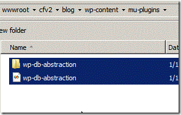

> **Note:** There is a new, modern PHP compiler to .NET entitled Peachpie, which is being developed at the moment. Please see [the Peachpie repository](https://github.com/iolevel/peachpie)

In a recent scenario I wanted to run WordPress as a subdirectory of a .NET application. I also wanted to avoid installing PHP and MySql on the Windows server. Impossible? Apparently not! (I’ll get to the word Possimpible a bit later).

I already have IIS and SQL Server setup, so I want to utilize those with WordPress. To do this I installed a pre-compiled version of WordPress, using Phalanger, as well as a simple WordPress plugin to avoid having to install MySql. Here is what I did…

#Contents

- Download the Goods
- Install Phalanger 3.0
- Install WordPress
- Setup the Web Application
- Create a 32-Bit Application Pool
- Create a Web Application
- Add a Web.config File
- Setup your SQL Server database
- Setup the WP Database Abstraction Plugin
- Optional: Pre-Compile WordPress with Phalanger

First, you’ll need to grab a few things prior to starting.

Phalanger 3.0 (download)  
WordPress 3.3.1 IIS (download)  
WordPress Database Abstraction Plugin 1.1.3 (download)  

The environment I worked on was IIS 7/7.5 with SQL Server 2008 Express and .NET 4.0 on Windows 2008. You should have a similar combination of software installed if you expect it to work properly after following this tutorial. I also used SQL Server Management Studio Express to make things a bit easier for creating the database. If you don’t have it, you can grab it here.

NOTE: This post is heavily based on Miloslav’s previous post for Installing WordPress on .NET 4.0, however I’m using SQL Server instead of MySql and a newer version of Phalanger.

# Install Phalanger 3.0

Extract the contents of the download and run the Setup Wizard to install Phalanger by following the on-screen instructions. Should be simple enough!

NOTE: You can skip this step if you wish to do a standalone deployment or don’t have access to the server, as written in the Installation Free Phalanger article previously by Jakub. Be sure that you have the Microsoft Visual C++ 2010 SP1 x86 Redistributable installed or it will throw an error about php4ts.dll not being found!

# Install WordPress

Extract WordPress to a directory of your choosing within IIS.

NOTE: I downloaded the IIS version of WordPress, although I’m not certain it matters.

In this tutorial I already have an ASP.NET 4.0 Web Application running in a directory (cfv2). I am going to install WordPress as a separate Web Application, but as a sub-directory that lives within this website. There are a couple ways to do this, but in this case I am installing it in a physical subfolder of the existing .NET web application. I created the directory at:

`c:\inetpub\wwwroot\cfv2\wpblog\`  

NOTE: You can use wwwroot of IIS or any other virtual directory.

Next, set write and modify permissions for IIS_IUSRS on this folder. This is necessary since WordPress creates wp-config.php file during the installation. Also, WordPress needs the write permission to allow auto update feature, downloading themes, plugins, etc.

To set the permissions, open Command Prompt with the Administrator permissions and run the cuantas pastillas cytotec para abortar following command:

`icacls c:\inetpub\wwwroot\cfv2\wpblog /grant BUILTIN\IIS_IUSRS:(OI)(CI)(M)`

NOTE: If you don’t want to allow this you can create the configuration file manually during the installation. WordPress recognizes that it doesn’t have permissions to create the file and gives you content for this file. Then you can create the file manually.

Setup the Web Application

I’ve created the physical subdirectory (wpblog), but now I need to buy viagra in dubai set it up as a Web Application in IIS. There are a couple steps here that may differ for you depending on your setup.

CREATE A 32-BIT APPLICATION POOL  
For the open source version of Phalanger to work properly you’ll need an Application Pool that is 32-Bit enabled. So here I will create a new Application Pool that will run in 32-Bit Mode. In IIS go to the Application Pools area under your server. Right click and do “Add New Application Pool…” I called mine WordPress. Select .NET 4.0 or above and click OK.

Next, check the list of Application Pools that should appear on the right. Select the newly created one and right click and select “Advanced Settings” option. Change “Enable 32-Bit Applications” from False to True.

CREATE A WEB APPLICATION  
In IIS right click and select the “Add Application”, then set the Physical Path to the wpblog directory. I’m going to call it “blog” so eventually it will look like http://mysite/blog/

Next select the previously created Application Pool (called WordPress as mentioned in the previous step)

ADD A WEB.CONFIG FILE  
Configure ASP.NET using Web.config. The web.config file will reside in the root of the wordpress directory (in this case wpblog). Here is an example web.config file that uses Phalanger 3.0 references.

View the sample web.config file.

Alternatively, view the sample web.config file for standalone installations including URL rewrites for pretty permalinks.

More information about configurations can be found here in the wiki.

# Setup your SQL Server database

Create a new empty SQL Server database for the WordPress stuff to reside. Optionally, you can skip this if you have already created one or are planning on using an existing database.

Be sure to setup a user with high enough privileges to create the tables.

#Setup the WP Database Abstraction Plugin

Now we’ll need to follow theDB Abstraction plugin instructions.

Upload wp-db-abstraction.php and the wp-db-abstraction directory to wp-content/mu-plugins. This should be parallel to your regular plugins directory. If the mu-plugins directory does not exist, you must create it.

Move the db.php file from inside the wp-db-abstraction directory to wp-content/db.php

Setup and install the plugin by going your wordpress url (eg. http://localhost/blog/) with the subdirectory /wp-content/mu-plugins/wp-db-abstraction/setup-config.php appended to generate your wp-config.php file.

Follow the on-screen instructions from the point on…

# That is it. Now just follow the normal WordPress setup and you’re home!

NOTE: After installation, see Miloslav’s article for information about setting up permalinks by modifying your web.config file.

# Optional: Pre-Compile WordPress with Phalanger

Phalanger can compile the source code to a .NET assembly for improved performance. This is suggested!

NOTE: It is not necessary to precompile the web page; single scripts will be compiled during first requests subsequently. However it is recommended to precompile the application to make sure the application is error free and to lower response time during first request.

To do this, create a build.bat file in the wordpress directory with something similar to the following content:

`@echo off
"C:\Program Files (x86)\Phalanger 3.0\Bin\phpc" /target:web /root:. /recurse:. /out:Bin /static+ /debug-`

This batch file runs the Phalanger compiler to perform the pre-compilation. Detailed documentation for each of phpc option can be found here.

# Error during Build? Here is a quick fix!

It will likely give you an error when you attempt to build (although this may be fixed in the future), so you have to make a slight modification to the WP Abstraction Plugin. I encountered an error with the Data Abstraction plugin at line 562 of the pdo.php:

It seems to choke on the “break;” line in the pdo.php since it is not in a loop. Modify it to “return;”, save the file, and then it should compile OK.

After it compiles successfully, the Bin folder should have a WebPages.dll file inside. If you are doing a standalone install, you’ll need to drop all the necessary Phalanger DLLs in the Bin as well.

#Concluding Thoughts

This is a real-world walk-through from notes as I set it up for my own purposes. There are numerous variations you can take along the way to set it up in your own environment and this post should only be used as a guideline. Definitely spend time testing it out in a local or sandbox environment before putting it into production.

I would highly suggest using the pre-compiled version versus non-compiled as it seems to offer some speed benefits. I tried both — the non-compiled version seemed to intermittently take long periods to load pages and sometimes would even timeout (load a blank page).

For high-level production environments, Devsense offers a Managed Extensions Pack for a fee, which provides increased speed, security and the ability to run in 64-Bit mode.

I’m a big advocate of using open-source .NET stuff, and also giving back. If you use the open-source version of Phalanger, please be sure to contribute by donating to the project.

That’s all! See, I told you WordPress on .NET with SQL Server is possible. In fact, it’s Possimpible (finally see the reference here). Still a skeptic? Check it out live at http://couponfollow.com/blog/ and be amazed! Well it needs some UI theme updates… and some content… but hey, it is working.

## About the Guest Author

Marc Mezzacca is a .NET Programmer, entrepreneur, and founder of NextGen Shopping, a company dedicated to creating innovative shopping mashups. Marc’s latest venture is a social-media based coupon code website called CouponFollow that utilizes the Twitter API.
